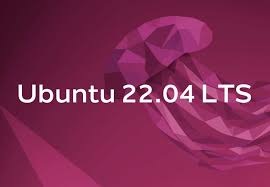

# Getting Started

## Overview

This section guides you through the basic requirements and preparation needed to work with **Pixel Robot**. By the end of this section, you will understand the system requirements, robot variants, and how to choose the correct configuration for your use case.

---

## System Requirements

Pixel Robot is designed to run natively on **Ubuntu 22.04 LTS** with **ROS 2 Humble Hawksbill**.

### Supported Operating System

- [Ubuntu 22.04 LTS (64-bit)](https://releases.ubuntu.com/jammy/)

### Required Software
- [ROS 2 Humble Hawksbill](https://docs.ros.org/en/humble/index.html) (Desktop or Desktop Full)
- Python 3.10+

> It is recommended to install the full ROS 2 desktop version to ensure compatibility with visualization and navigation tools.

---

## Supported Robot Variants

Pixel Robot is available in three hardware variants. Each variant builds on the previous one, adding new sensing and perception capabilities.

### [V1](https://github.com/MRS111-OS/titan_robot) – LIDAR-Based Navigation

**Primary Use Case:**  
Basic autonomous navigation and SLAM

**Features:**
- Differential drive mobile base
- 2D LIDAR for mapping and obstacle detection
- Wheel encoder–based odometry
- ROS 2 Navigation Stack support
- Keyboard or joystick teleoperation

**Typical Applications:**
- Learning ROS 2 navigation
- Mapping and localization experiments
- Indoor autonomous navigation

---

### [V2](https://github.com/MRS111-OS/titan_robot/tree/v2) – LIDAR + Vision (Pi Camera)

**Primary Use Case:**  
Autonomous navigation with visual object detection

**Additional Features over V1:**
- Raspberry Pi Camera module
- Vision-based object detection
- Camera integration with ROS 2 image pipeline

**Typical Applications:**
- Object detection and tracking
- Vision-based robotics projects
- AI perception experiments

---

### [V3](https://github.com/MRS111-OS/titan_robot/tree/v3) – LIDAR + Depth Vision (Intel RealSense)

**Primary Use Case:**  
Advanced perception and 3D-aware navigation

**Additional Features over V2:**
- Intel RealSense depth camera
- RGB-D perception
- Depth-based obstacle understanding
- Enhanced perception for autonomy

**Typical Applications:**
- 3D perception research
- Depth-aware navigation
- Advanced autonomous robotics projects

---

## Choosing the Right Variant

| Variant | LIDAR | Camera | Depth | Use Case |
|------|------|------|------|------|
| V1 | ✓ | ✗ | ✗ | Navigation & SLAM |
| V2 | ✓ | Pi Camera | ✗ | Navigation + Object Detection |
| V3 | ✓ | RealSense | ✓ | Advanced Perception & Autonomy |

Choose the variant that best matches your learning goals or project requirements.

You’re now ready to begin working with Pixel Robot 🚀
