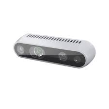

# Hardware Overview

## Overview

This section describes the complete hardware architecture of **Titan Robot**, including its mechanical structure, compute units, sensors, electronics, and power system.

---

## Hardware Architecture

Titan Robot follows a layered hardware design:

- **Compute Layer** – Runs high-level ROS 2 software
- **Control Layer** – Handles real-time motor control and odometry
- **Sensor Layer** – Provides perception and environment awareness
- **Power Layer** – Supplies regulated power to all subsystems

Each layer is designed to be independent and modular.

---

## Mechanical Design

### Chassis

- Differential-drive mobile base
- Rigid frame with mounting points for:
  - Compute unit
  - Battery
  - Motor controller
  - Sensors
- Passive caster wheel for balance
- Compact footprint for indoor navigation

### Drive System

- Two DC gear motors
- Quadrature wheel encoders
- Rubber wheels for traction
- Encoder feedback used for odometry and closed-loop control

---

## Compute Unit

### Main Controller

- Raspberry Pi 4B (8GB RAM)
- Runs Ubuntu 22.04 LTS
- Hosts all ROS 2 nodes
- Handles:
  - SLAM and localization
  - Navigation and planning
  - Perception pipelines
  - User interfaces and visualization

### Connectivity

- USB interfaces for sensors and microcontroller
- WiFi and Ethernet for remote access
- GPIO headers for expansion

---

## Control Electronics

### Motor Controller (ESP32)

- ESP32 MCU for real-time control
- Responsibilities:
  - Motor PWM control
  - PID velocity control
  - Encoder reading
  - Odometry computation
- Communicates with the compute unit via serial interface
- Publishes odometry and receives velocity commands through ROS 2

---

## Sensor Suite

### 2D LIDAR

- 360° scanning range
- Used for:
  - Mapping (SLAM)
  - Localization
  - Obstacle detection
- Publishes laser scan data to ROS 2

### Camera Systems

The camera configuration depends on the robot variant:

#### Variant V1
- No camera
- Navigation relies solely on LIDAR and odometry

#### Variant V2

- Raspberry Pi Camera
- Used for:
  - Object detection
  - Vision-based perception
  - Image processing pipelines

#### Variant V3

- Intel RealSense depth camera
- Provides:
  - RGB images
  - Depth data
  - 3D perception capabilities

---

## Power System

### Battery

- 11.1V 2500mAh NMC (Lithium Nickel Manganese Cobalt Oxide)
- Rechargeable lithium-based battery
- Provides sufficient capacity for extended operation
- Mounted securely within the chassis

### Power Distribution

- Main battery output distributed to:
  - Motor driver circuitry
  - Compute unit via voltage regulator
  - Sensors and peripherals
- Separate regulated rails to ensure stable operation

### Voltage Regulation

- Step-down regulators used to supply:
  - 5V for compute unit and logic
  - Motor voltage as required by motors
- Designed to handle peak current during motor startup

---

## Power Management & Safety

- Power switch for safe startup and shutdown
- Inline protection (fuse or current limiter)
- Reverse polarity and overcurrent protection

---

## Charging System

- Dedicated charging port
- Charging circuit includes:
  - Overvoltage protection
  - Overcurrent protection
  - Thermal safety mechanisms

---

## Expansion & Customization

Titan Robot is designed for extensibility:

- USB ports for additional sensors
- GPIO access for custom electronics
- Mounting space for:
  - Extra sensors
  - Displays
  - External controllers

This makes the platform suitable for both educational use and advanced research.

You now have a complete overview of Titan Robot’s hardware platform 🚀
