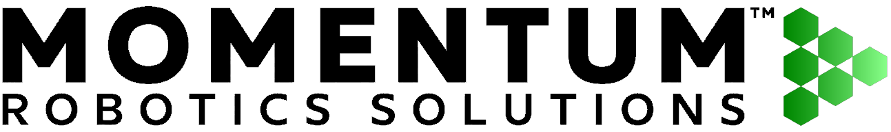

<h1>Introduction</h1>
<a href="https://github.com/MRS111-OS/titan_robot" class=""  style="display: flex; gap: 10px; align-items: center;">

Github Link
          
 </a>

  

[Github Link](https://github.com/MRS111-OS/titan_robot)

## Overview

**Pixel Robot** is a ROS 2–based mobile robot platform designed for learning, experimentation, and real-world robotics development. Built with cost efficiency and modularity in mind, Pixel Robot enables students, researchers, and developers to explore modern robotic concepts such as autonomous navigation, mapping, localization, and robot software architecture using ROS 2.

The platform combines reliable hardware with a flexible software stack, making it suitable for education, prototyping, and research applications. Pixel Robot emphasizes hands-on learning by exposing users to both high-level autonomy and low-level motor control.

---

## Design Goals

Pixel Robot was designed with the following goals:

- **Affordability** – Accessible hardware without compromising core robotics capabilities  
- **Modularity** – Easy to extend with additional sensors and peripherals  
- **ROS 2 Native** – Built entirely around ROS 2 concepts and workflows  
- **Educational Focus** – Clear architecture suitable for learning and teaching  
- **Real-World Readiness** – Designed to operate reliably outside simulation  

---

## Key Capabilities

Pixel Robot supports a wide range of robotics functionalities out of the box:

- Differential-drive mobile base
- Real-time motor control with encoder feedback
- 2D LIDAR-based mapping and obstacle detection
- Autonomous navigation using ROS 2 Navigation Stack
- Teleoperation via keyboard or joystick
- Visualization and debugging using RViz2
- Custom firmware and software development

---

## Key Metrics for Pixel Robot

| Category | Parameter | Value |
|--------|----------|-------|
| **Drive / Base** | Drive type | Differential drive mobile base |
| **Drive / Base** | Motors | 2× DC gear motors |
| **Odometry** | Encoders | Quadrature wheel encoders |
| **Compute** | Main computer | Raspberry Pi 4B |
| **Compute** | RAM | 4 GB and 8 GB |
| **OS** | Operating system | Ubuntu 22.04 LTS |
| **Control** | Low-level controller | Custom Momentum Robotics Compute board ESP32 S3 based |
| **Control** | Motor control | PWM + PID velocity control |
| **Control** | Compute ↔ MCU interface | Serial interface |
| **Sensors** | LiDAR | 2D LiDAR, 360° scanning range |
| **Sensors** | Camera | V1: No camera V2: Raspberry Pi Camera V3: Intel RealSense depth camera |
| **Power** | Battery voltage | 11.1 V |
| **Power** | Battery type | FPF battery, 4400 mAh |
| **Software** | Navigation stack | ROS 2 Nav2 |
| **Interface** | Visualization | RViz2 supported |

## Created By

[Momentum Robotics](https://imomentumrobotics.in/) is an Indian Robotics Startup.

## Next Steps

To begin working with Pixel Robot, proceed to:

- **Getting Started** – System requirements and setup  
- **Hardware Overview** – Mechanical and electronic design  
- **Software Architecture** – ROS 2 node and communication structure  

Let’s get started 🚀
