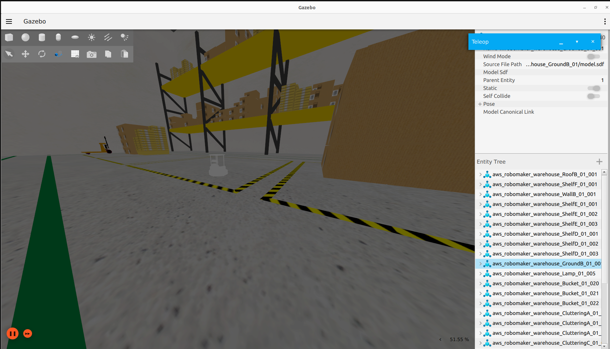
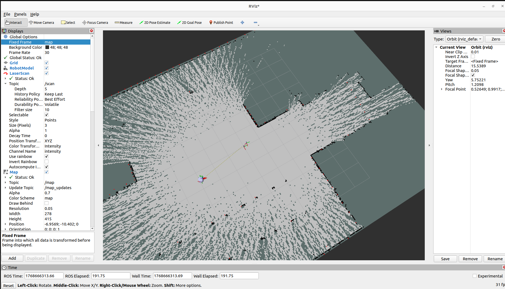
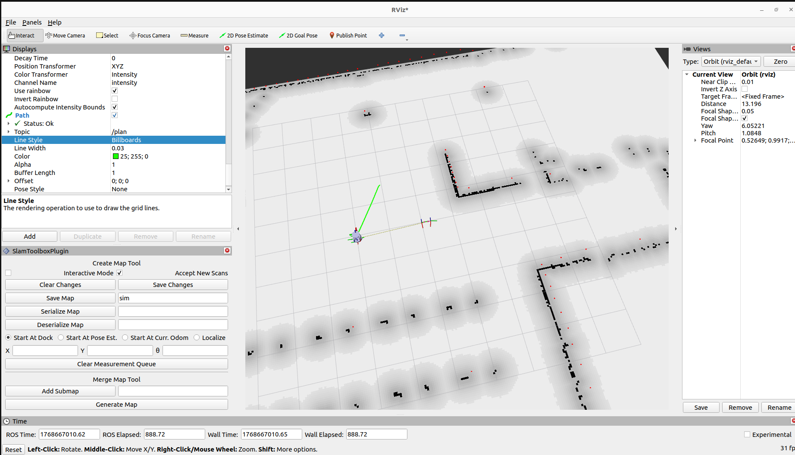

# Simulation

## Overview

Simulation allows you to test Pixel Robot’s software stack in a virtual environment before running it on real hardware. Pixel Robot uses **Ignition Gazebo (Gazebo Fortress)** integrated with ROS 2 through **ros_gz_sim** to provide a realistic simulation of sensors, robot motion, mapping, and navigation.

Simulation is strongly recommended for:
- Testing navigation parameters
- Debugging SLAM and localization
- Developing new features safely
- Learning ROS 2 workflows without hardware risk

---

## Simulation Stack

The simulation setup consists of:

- Ignition Gazebo (Gazebo Fortress)
- ros_gz_sim for ROS 2 ↔ Gazebo integration
- Simulated Pixel Robot model
- Simulated sensors (LIDAR)
- RViz2 for visualization

---

## Setup

### Installing Ignition Gazebo (Gazebo Fortress)

Install Ignition Gazebo Fortress:
```bash
sudo apt update  
sudo apt install ignition-fortress
```
Verify installation:
```bash
ign gazebo --version
```
---

### Installing ROS–Gazebo Integration

Install the ROS 2 Gazebo integration packages:
```bash
sudo apt install ros-humble-ros-gz-sim  
sudo apt install ros-humble-ros-gz-bridge  
sudo apt install ros-humble-ros-gz-image
```
These packages enable communication between ROS 2 and Ignition Gazebo.

---

### Preparing the Workspace

Ensure your Pixel Robot workspace is built and sourced:
```bash
cd ~/titan_ws  
colcon build  
source install/setup.bash
```


NOTE: If running simulation in a virtual machine:
```bash
export LIBGL_ALWAYS_SOFTWARE=1
export IGN_RENDER_ENGINE=ogre
export GZ_SIM_RENDER_ENGINE=ogre
```

 This is used to make CPU use ogre renderer to launch gazebo.

---

## Launching the Simulation

Start the simulation using the Pixel Robot simulation bringup:
```bash
ros2 launch titan_nav bringup.launch.py
```
This launch file performs the following actions:



- Starts Ignition Gazebo
- Loads the warehouse world
- Spawns the Pixel Robot model
- Launches simulated LIDAR
- Bridges Gazebo sensor data to ROS 2
- Starts RViz2 with a preconfigured view

---

### Verifying the Simulation


Once launched, verify the following:

- The robot appears in the Gazebo warehouse world
- RViz2 shows the robot model
- LIDAR scan data is visible in RViz2
- TF frames are correctly published

At this stage, the robot is ready for mapping.

---

## Mapping in Simulation

### Launching SLAM

Open a new terminal, source the workspace, and launch SLAM:
```bash
source ~/titan_ws/install/setup.bash  
ros2 launch titan_nav slam.launch.py
```
This launch file runs **SLAM Toolbox in online asynchronous mode**, using simulated LIDAR data.

---

### Visualizing the Map



In RViz2:

- Set Fixed Frame to `map`
- Add the Map display if not already visible
- Observe the map being generated as the robot moves

You can use teleoperation to explore the environment and build the map.

---

### Saving the Map

Once mapping is complete:

1. In RViz2, open the **Slam Toolbox Plugin**
2. Click **Save Map**
3. Choose a directory and map name

This generates a `.yaml` and `.pgm` map file that can be reused for navigation.

---

## Navigation in Simulation

After saving the map, stop the SLAM launch and start navigation.

Run the following command in a new terminal:
```bash
ros2 launch titan_nav nav2.launch.py use_sim_time:=true map:=/absolute/path/to/your/map.yaml
```
This launch file starts:

- Map server
- Localization
- Navigation stack (Nav2)
- Costmaps and planners

The `use_sim_time` argument ensures synchronization with simulation time.

---

### Sending Navigation Goals



In RViz2:

1. Set Fixed Frame to `map` and give **2D Pose Estimate**
2. Use the **2D Goal Pose** tool
3. Select a goal location in the map

The robot will autonomously navigate to the goal within the simulated environment.

---

## Simulation Time

Simulation runs on a simulated clock.

Ensure that:
- `use_sim_time` is set to true
- Nodes are synchronized to Gazebo time

This is critical for correct SLAM and navigation behavior.

---


## Common Simulation Issues

| Issue | Possible Cause | Solution |
|-----|---------------|---------|
| Robot not moving | Controllers not loaded | Check bringup launch logs |
| No LIDAR data | Bridge not running | Verify ros_gz bridges |
| Navigation fails | Map not loaded | Check map file path |
| Time-related errors | use_sim_time false | Enable simulation time |

---

## Simulation vs Real Robot

Key differences to keep in mind:

- Simulation has perfect sensor alignment
- No wheel slip unless modeled
- Odometry is ideal compared to real robot
- Navigation may appear smoother in simulation
