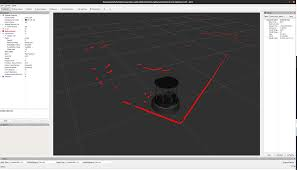
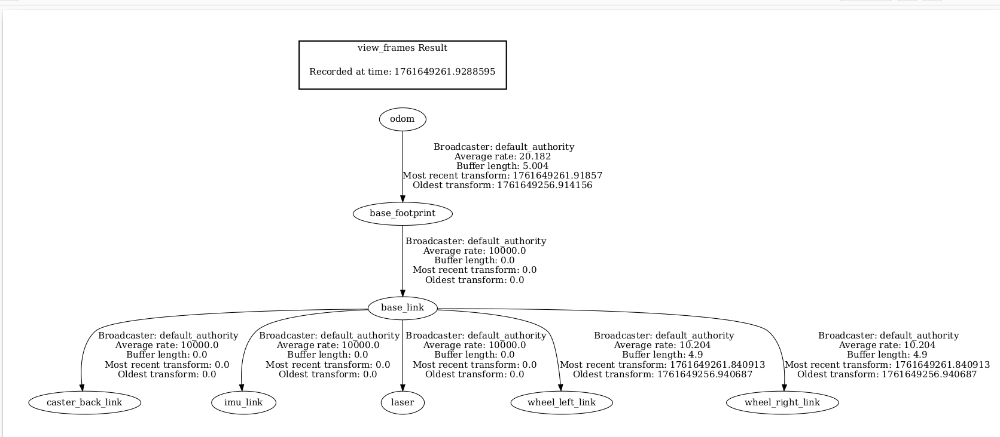
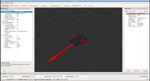

# Visualization & Debugging

## Overview

Visualization and debugging tools are essential for understanding robot behavior, validating sensor data, and diagnosing issues during development.  
This section introduces the primary tools used with **Titan Robot** to visualize data and debug the ROS 2 system.

The main tools covered are:

- RViz2
- rqt tools
- ROS 2 command-line utilities

---

## RViz2 Overview


RViz2 is the primary visualization tool used to view the robot’s state, sensor data, and navigation information.

With RViz2, you can visualize:

- Robot model (URDF)
- Coordinate frames (TF)
- Laser scan data
- Odometry
- Maps
- Navigation goals and paths

RViz2 is typically launched automatically during robot bringup.

---

## RViz2 Configuration

### Fixed Frame


Ensure the **Fixed Frame** is set correctly:

- Recommended: `odom` (or `map` when mapping/localization is active)

Incorrect fixed frames are a common source of visualization issues.

---

### Common RViz Displays

Recommended displays to enable:

- **RobotModel** – Shows the robot URDF
- **TF** – Visualizes coordinate frames
- **LaserScan** – Displays LIDAR data
- **Odometry** – Visualizes robot motion
- **Map** – Shows generated or loaded maps
- **Path** – Displays navigation paths

---

## Verifying Sensor Data

### LIDAR Visualization




- Add a **LaserScan** display
- Topic: `/scan`
- Verify that obstacles appear correctly around the robot
- Ensure scan rotates with the robot frame

---

### Camera Visualization (V3)


- Add an **Image** display
- Topic:
  - V2: `/camera/image_raw`
  - V3: `/camera/color/image_raw`
- Confirm image stream updates in real time

---

## TF Debugging

TF (transform) errors are one of the most common issues in ROS-based systems.

### Visualizing TF Frames

Enable the **TF** display in RViz2 to:

- Verify correct frame hierarchy
- Check transform directions
- Identify missing or misaligned frames

Common frames include:

- `map`
- `odom`
- `base_link`
- `laser`
- `camera_link`

---

### Generating TF Tree
```bash
ros2 run tf2_tools view_frames
```



This generates a PDF showing the complete TF tree.

---

## Odometry Debugging

### Checking Odometry Topic

```bash
ros2 topic echo /odom
```


Verify that:

- Position updates when the robot moves
- Orientation changes during rotation
- No sudden jumps or drift at standstill

---

### Visualizing Odometry

- Add **Odometry** display in RViz2
- Check smooth motion and correct orientation
- Verify odom frame alignment




---

## rqt Tools


rqt provides GUI-based debugging and introspection tools.

### rqt_graph

```bash
rqt_graph
```


- Visualizes node and topic connections
- Useful for verifying data flow
- Helps detect missing or misconnected nodes

---

### rqt_plot

```bash
rqt_plot
```

- Plot values over time
- Useful for:
  - Odometry velocity
  - Encoder-derived data
  - Sensor readings

---

### rqt_console

```bash
rqt_console
```


- Displays ROS 2 log messages
- Filter logs by severity and node
- Useful for runtime error detection

---

## Command-Line Debugging Tools

### List Nodes

```bash
ros2 node list
```

---

### Inspect Node Info

```bash
ros2 node info <node_name>
```

---

### Topic Frequency

```bash
ros2 topic hz /scan
ros2 topic hz /odom
```

Ensures data is being published at expected rates.

---

## Common Debugging Scenarios

| Issue | Debugging Step |
|-----|---------------|
| Robot not moving | Check `/cmd_vel` and serial node |
| No LIDAR data | Check `/scan` topic and USB connection |
| Navigation fails | Inspect costmaps and TF |
| Map drifting | Check odometry accuracy |
| RViz empty | Verify fixed frame and TF tree |

---

## Debugging Best Practices

- Always check `/tf` first
- Verify sensor topics before navigation
- Use low speeds during testing
- Debug one subsystem at a time
- Keep RViz displays minimal to improve performance


With proper visualization and debugging, diagnosing robot issues becomes significantly easier 🚀


